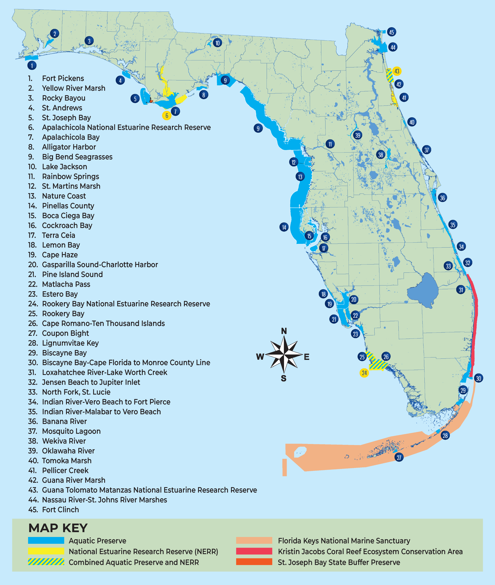

\newpage

# Introduction

## What is SEACAR?

The Statewide Ecosystem Assessment of Coastal and Aquatic Resources project was developed by the Florida Department of Environmental Protection's (DEP) [Office of Resilience and Coastal Protection (RCP)](https://floridadep.gov/orcp), through consultation with [Florida Coastal Management Program (FCMP)](https://floridadep.gov/fcmp) partner agencies, to enhance existing coastal and aquatic management efforts and address identified management needs. The project was designed to look at site-specific status and trends of the submerged resources within RCP managed areas to gain statewide perspective. Each of RCP's managed areas is unique. However, visualizing the state's estuarine managed areas as a whole and looking at the habitats that connect them allows us to build upon a common goal of preserving their scientific, economic, aesthetic and recreational values for the benefit of future generations.

<br>

## Geographic Scope

RCP manages over 5 million acres of coastal and submerged lands across 34 of Florida's 35 coastal counties, encompassing the extensive coastal marshes of the northeast coast, oyster reefs and seagrass beds of the northern Gulf Coast, and crystal-clear waters and coral reefs of South Florida.

The assessment is divided into four geographic regions (northwest, southwest, northeast, and southeast) based on RCP management boundaries. It encompasses RCP's 38 estuarine aquatic preserves and three national estuarine research reserves, the Coral Reef Conservation Program, and the Florida Keys National Marine Sanctuary, which are managed in partnership with the National Oceanic and Atmospheric Administration. See the \@ref(StateOverview) section for additional details.

<br>

## Why is SEACAR Important?

The SEACAR project is a collaborative effort engaging a diverse group of stakeholders. Federal, state, local and nongovernmental agencies as well as academic institutions invest time and money in monitoring, protecting and restoring the state's natural resources. By utilizing current scientific knowledge about our ecosystems, we can look for ways to improve conservation efforts through partnerships, standardizing monitoring methods, reducing duplication of efforts, and pooling resources to capitalize on research and funding opportunities.

The project utilizes current knowledge and scientific data from coastal and marine managed areas to assess the status and long-term trends of submerged habitats, within RCP's estuarine managed areas, to provide the best available science to help guide planning, management, restoration, and policy decisions.

SEACAR Goals:

-   Provide consistent data to help coastal managers and planners prioritize and focus management and restoration efforts.
-   Establish a consistent system-wide approach to show statewide and site-specific trends over time.
-   Translate valuable ecological data into easy-to-read, publicly available documents capable of informing Florida's diverse population of coastal stakeholders.
-   Inform management plans developed for each aquatic preserve and national estuarine research reserve.
-   Determine the frequency of habitat assessments to allow for adaptive management.
-   Promote increased awareness among legislators and the public to improve:
    -   Environmental literacy.
    -   Policy changes when necessary.
    -   Support for scientifically sound policies and programs.

Florida has become a data-rich state due to researchers and managers providing a wealth of knowledge over the years relating to the state's environmental resources. However, environmental monitoring programs are not always well described or easily located. The [SEACAR Data Discovery Interface](https://data.florida-seacar.org/) was created to provide user-friendly, informative and interactive pages linked to the wealth of environmental data, spatial data, protocols and publications across the state.

The SEACAR Data Discovery Interface provides standardized data for submerged and coastal habitats in one place and includes a mapping feature to allow users to visualize data and overlay monitoring sites to assess data gaps, opportunities and partnerships.

<br>

## Funding

SEACAR is funded by a grant provided through the Florida Coastal Management Program, under the [Coastal Zone Management Act of 1972](https://coast.noaa.gov/czm/act/), as amended, National Oceanic and Atmospheric Administration.

\bigskip

# Statewide Overview {#StateOverview}

The RCP manages a statewide network of marine protected areas encompassing over 5 million acres of the state's most pristine and diverse marine, coastal and aquatic habitats, from mangroves and salt marshes to seagrass beds, coral reefs and oyster reefs.

The statewide network of 42 aquatic preserves, three national estuarine research reserves (NERRs), the Florida Keys National Marine Sanctuary (FKNMS) and Florida's Coral Reef Conservation Program (CRCP) are managed to preserve and protect the scientific, economic, aesthetic and recreational values associated with the state's submerged resources for the benefit of future generations.

<br>

## National Estuarine Research Reserve System

Florida's NERRs are part of the National Estuarine Research Reserve System, which encompasses a nationwide network of 30 coastal sites spanning 1.3 million acres. Designated to protect and study estuarine systems, management of the research reserves focuses on four primary components: 1) stewardship, 2) research, 3) training, and 4) education. The NERRS are cooperatively managed by the National Oceanic and Atmospheric Administration (NOAA) and the coastal states. Established through the Coastal Zone Management Act, NERRs are managed by a lead agency or university with input from local partners. NOAA provides funding and guidance.

<br>

## Aquatic Preserves

Aquatic preserves are state-owned sovereign submerged lands in areas that have been set aside for the benefit of future generations due to their exceptional biological, aesthetic and scientific value (Chapter 258.39, Florida Statutes) and they hold the designation of Outstanding Florida Waters (62-302.700, Florida Administrative Code).

The first aquatic preserve, Estero Bay, was established in Southwest Florida in 1966. In 1975, the Florida Aquatic Preserve Act was passed, and the existing preserves were brought under a standard set of management criteria. Today, Florida has 42 aquatic preserves, encompassing over 5.2 million acres. The most recent designation was the Nature Coast Aquatic Preserve in 2020.

<br>

## Coral Reef Conservation Program

The Coral Reef Conservation Program coordinates research and monitoring along the northern section of Florida's Coral Reef, which extends over 350 nautical miles from the St. Lucie Inlet in Martin County to the Dry Tortugas. The program also develops management strategies and promotes partnerships to protect the coral reefs, hardbottom communities and associated reef resources.

In 2018, House Bill 53 passed, establishing and protecting the Coral Reef Ecosystem Conservation Area (ECA). The ECA includes the sovereign submerged lands and state waters offshore of Martin, Palm Beach, Broward and Miami-Dade counties from the northern boundary of Biscayne National Park to the St. Lucie Inlet.

<br>

## Florida Keys National Marine Sanctuary

The Florida Keys National Marine Sanctuary is one of 15 Marine Protected Areas that make up the National Marine Sanctuary System. It encompasses 2,900 square nautical miles of waters surrounding the Florida Keys, from south of Miami westward to the Dry Tortugas, excluding Dry Tortugas National Park.

Designated in 1990, the FKNMS is administered by NOAA and is jointly managed with the state of Florida. The sanctuary is managed to encourage recreational activities such as diving, swimming, snorkeling and fishing while reducing user conflict and protecting cultural and natural resources that include shipwrecks, a coral barrier reef system, seagrass beds, mangroves and associated marine life.

<br>

## Office of Resilience and Coastal Protection Regions

The SEACAR assessment is divided into four regions: northwest, southwest, northeast and southeast. These regions mirror Office of Resilience and Coastal Protection's (RCP)'s management regions and were developed based on location and management needs. Aquatic preserve offices gain local support for their science-based management through coordination with the regional research reserves and the Coral Reef Conservation Program.

```{r StateMap, out.width = '100%', fig.cap = "The Office of Resilience and Coastal Protection oversees a total of 45 managed areas around the state that include a wide variety of marine, estuarine, aquatic, and upland habitats."}



```
